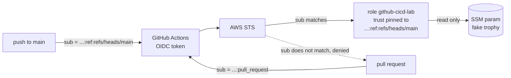

# Architecture

## The one control that matters

AWS issues credentials by comparing the token's `sub` to the trust policy. Repo visibility, who opened the PR, and what the workflow says do not factor in. Pin `sub` to `ref:refs/heads/main` or a protected environment and a poisoned pull request has nowhere to go, even on a public repo.

## Layers in this lab

1. GitHub will not give `id-token: write` to a forked PR, so external forks cannot get a token.
2. The trust only accepts `...:ref:refs/heads/main`, so same-repo PRs are denied too.
3. The role reads one fake secret and nothing else.
4. The workflow prints only that fake secret, so the public log leaks nothing real.
