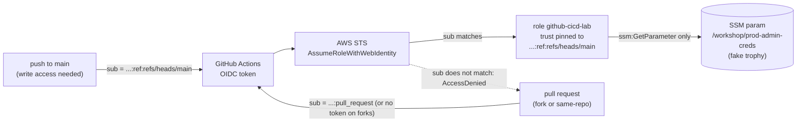

# Architecture

## The one control that matters

AWS decides whether to issue credentials by comparing the token's `sub` claim to the trust policy. Repo visibility, who opened the PR, and what the workflow file says are all irrelevant to that decision. Pin `sub` to `ref:refs/heads/main` (or a protected environment) and the blast radius of a poisoned pull request drops to zero, even on a public repo.

## Layers of defense here

1. GitHub will not grant `id-token: write` to a forked pull request, so external forks cannot mint a usable token.
2. The trust policy only accepts `...:ref:refs/heads/main`, so same-repo pull requests are denied too.
3. The role can read one fake secret and nothing else, so a pivot has nowhere to go.
4. The workflow prints only that fake secret, so the public Actions log leaks nothing real.
